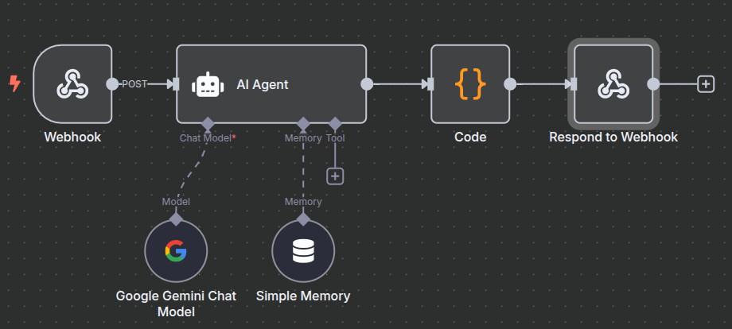
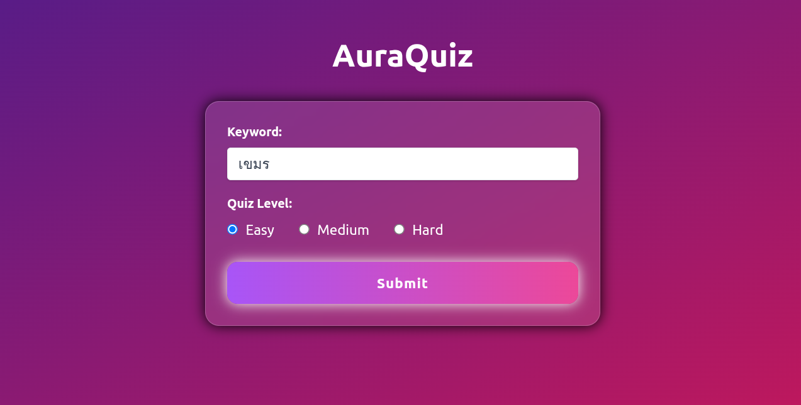
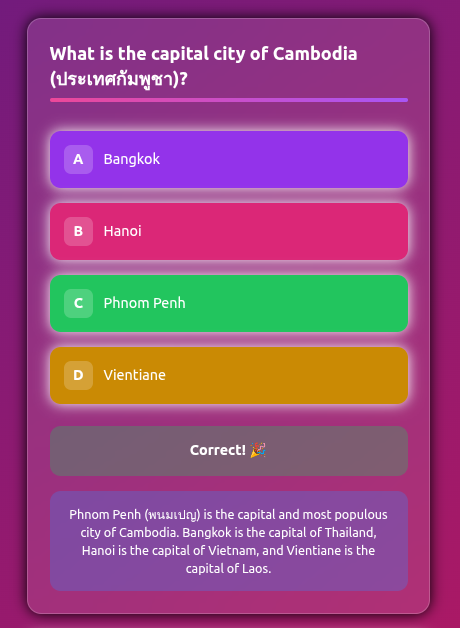
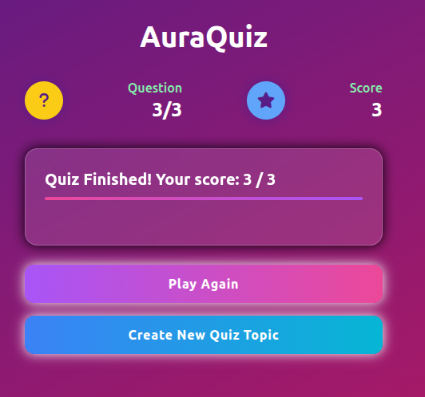

# ซอร์สโค้ดนี้ ใช้สำหรับเป็นตัวอย่างเท่านั้น ถ้านำไปใช้งานจริง ผู้ใช้ต้องจัดการเรื่องความปลอดภัย และ ประสิทธิภาพด้วยตัวเอง

# AuraQuiz 🔮

AuraQuiz is a dynamic, AI-powered quiz generation application. It allows users to create unique quizzes on any topic and at varying difficulty levels, providing an engaging and interactive learning experience. The project leverages a modern web stack, combining a Node.js backend with a sleek, responsive frontend, all orchestrated by an n8n workflow powered by Google's Gemini AI.



## ✨ Features

- **AI-Powered Quiz Generation:** Creates unique multiple-choice quizzes on any user-specified keyword or topic.
- **Variable Difficulty:** Supports "Easy," "Medium," and "Hard" difficulty levels to tailor the challenge.
- **Interactive UI:** A vibrant and responsive user interface built with TailwindCSS.
- **Instant Feedback:** Provides immediate correctness feedback and detailed explanations for each answer.
- **Score Tracking:** Keeps track of the user's score throughout the quiz.
- **Session Management:** Ensures a consistent quiz experience for the user.
- **Decoupled Architecture:** Uses a robust architecture with a separate frontend, backend, and n8n workflow for scalability and maintenance.

## 🛠️ Architecture

The project is composed of three main components:

1.  **Frontend (`src/`)**:
    *   A static web interface built with **HTML, TailwindCSS, and vanilla JavaScript**.
    *   `index.html`: The landing page where users can input a topic and select a difficulty level.
    *   `quiz.html`: The interactive quiz page that dynamically displays questions, options, feedback, and the final score.

2.  **Backend (`server/`)**:
    *   A lightweight **Node.js** server using the **Express** framework.
    *   Serves the static frontend files.
    *   Provides an API endpoint (`/submit-quiz`) that receives user input and forwards it to the n8n webhook.
    *   Receives the generated quiz from n8n, caches it in `quiz.json`, and serves it to the frontend via the `/api/quiz-data` endpoint.

3.  **n8n Workflow:
    *   The core logic of the application, orchestrated in **n8n**.
    *   **Webhook Node**: Receives the topic and difficulty from the backend.
    *   **AI Agent (LangChain)**: Uses a detailed prompt to instruct the **Google Gemini** model to generate a 3-question multiple-choice quiz.
    *   **Code Node**: Parses the AI's markdown response into a structured JSON format.
    *   **Respond to Webhook**: Sends the structured JSON quiz data back to the Node.js server.

## 🚀 Getting Started

Follow these instructions to get a local copy up and running.

### Prerequisites

- [Node.js](https://nodejs.org/) (v14 or higher)
- An [n8n](https://n8n.io/) instance (cloud or self-hosted)
- A Google Gemini (or Palm) API key

### 1. n8n Workflow Setup

1.  **Create Workflow**: Open your n8n canvas and create workflow.
2.  **Add Credentials**: In the "Google Gemini Chat Model" node, create or select your Google API credentials.
3.  **Activate Workflow**: Save and activate the workflow. The webhook URL will be used by the backend server.

### 2. Backend & Frontend Setup

1.  **Navigate to the server directory**:
    ```bash
    cd server
    ```
2.  **Install dependencies**:
    ```bash
    npm install
    ```
3.  **Start the server**:
    ```bash
    npm start
    ```
    This will start the server on `http://localhost:3000` using `nodemon`, which automatically restarts the server on file changes.

### 3. Access the Application

Open your web browser and navigate to **[http://localhost:3000](http://localhost:3000)**. You should see the AuraQuiz home page.

## 📸 Screenshots

| Form Input | Quiz Question | Final Score |
| :---: | :---: | :---: |
|  |  |  |
